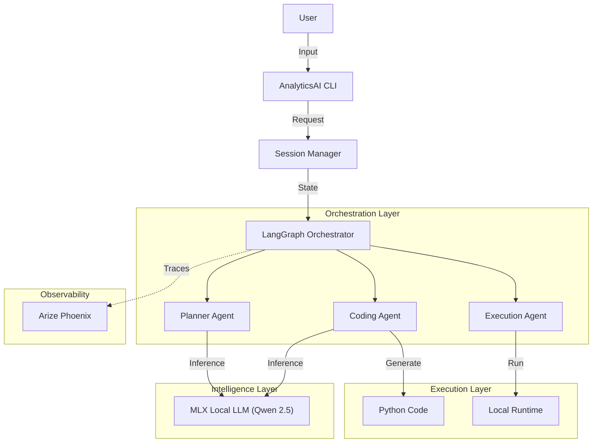

# AnalyticsAI

**AnalyticsAI** is a code-first agent framework for data analytics, powered by Local LLMs and LangGraph. It enables users to perform complex data tasks through natural language, orchestrating a team of intelligent agents to plan, generate code, and execute it locally.

## 🚀 Features

- **Local LLM Support**: Optimized for Apple Silicon using MLX (Qwen 2.5 7B).
- **LangGraph Orchestration**: Robust state-machine based agent workflow (`Planner` -> `Coding` -> `Execution`).
- **Code Interpreter**: Generates and executes Python code safely to solve tasks.
- **Observability**: Built-in support for LLM tracing via **Arize Phoenix**.
- **Data-Centric**: Designed for data analysis, visualization, and transformation.

## 🏗️ System Architecture

The system follows a cyclic multi-agent architecture where a Planner breaks down tasks, a Coding Agent generates Python solutions, and an Execution Agent runs them.



## 🛠️ Getting Started

### Prerequisites
- Python 3.10+
- Docker (for Arize Phoenix tracing)
- Apple Silicon Mac (M1/M2/M3) for MLX support

### Installation

1.  **Clone the repository** (if not already local).
2.  **Create a virtual environment**:
    ```bash
    python3 -m venv venv
    source venv/bin/activate
    ```
3.  **Install dependencies**:
    ```bash
    pip install -r requirements.txt
    pip install mlx-lm langgraph langchain-core opentelemetry-sdk opentelemetry-exporter-otlp
    ```

### Running the System

1.  **Start Arize Phoenix (Tracing)**:
    ```bash
    cd tracing
    docker compose -f docker-compose.phoenix.yaml up -d
    ```

2.  **Start Local LLM Server**:
    In a separate terminal:
    ```bash
    mlx_lm.server --model mlx-community/Qwen2.5-7B-Instruct-4bit --port 8080
    ```

3.  **Run AnalyticsAI**:
    ```bash
    source venv/bin/activate
    python -m taskweaver -p ./project/
    ```

## 📖 Usage

Once the CLI starts, simply key in your request:
> "Calculate the factorial of 10"
> "Generate 100 random numbers and plot a histogram"

AnalyticsAI will plan the solution, write the code, execute it, and show you the result.

## 📄 License
[LICENSE](LICENSE)
